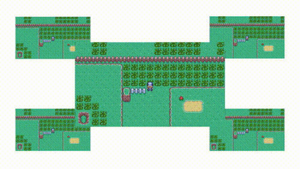
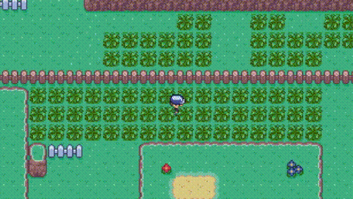
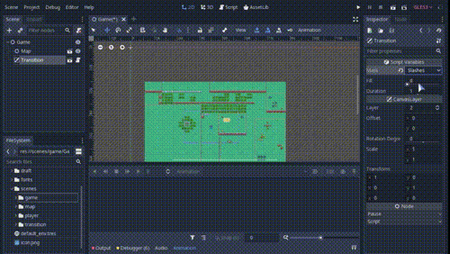

# [Godot] Pokemon Transitions
Old pokemon-style screen transitions.

## [:tv: Video sample](http://www.youtube.com/watch?v=7MrJkCDC1pU)

## How does it work?
This transition uses an Alpha Test shader and attempts to replicate retro GameBoy-style Pokemon battle transitions.
Most transition-related files are in the transitions directory:

### [Transitions Directory](godot-pokemon-transitions/scenes/transition)
 - [Transition shader](godot-pokemon-transitions/scenes/transition/Transition.shader)
 - [Transition sprite](godot-pokemon-transitions/scenes/transition/TexRect.gd)
 - [Transition scene](godot-pokemon-transitions/scenes/transition/Transition.gd)
